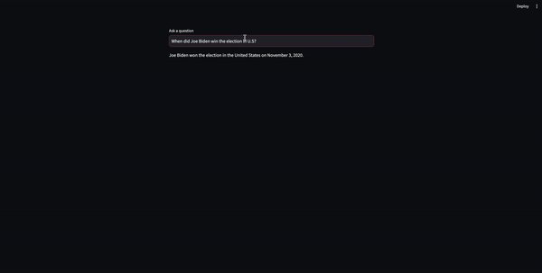

Chat Your Doc (Experimental)
=============

Chat Your Doc is an experimental project aimed at exploring various applications based on LLM. Although it is nominally a chatbot project, its purpose is broader. The project explores various applications using tools such as [LangChain](https://www.langchain.com/) or [scikit-learn LLM](https://github.com/iryna-kondr/scikit-llm). In the "Lab Apps" section, you can find many examples, including simple and complex ones. The project focuses on researching and exploring various LLM applications, while also incorporating other fields such as UX and computer vision. The "Lab App" section includes a table with links to various apps, descriptions, launch commands, and demos.

 

# Lab Apps

| App | Description | Launch | Demo |
| --- | --- | --- | --- |
| [open_api_llm_app.py](simply/open_api_llm_app.py)  | Use OpenAI LLM to answer simple question | `streamlit run simply/open_api_llm_app.py --server.port 8001 --server.enableCORS false` |  | 
| [sim_app.py](simply/sim_app.py)  | Use the vector database to save file in chunks and retrieve similar content from the database | `streamlit run simply/sim_app.py --server.port 8002 --server.enableCORS false` |  | 
