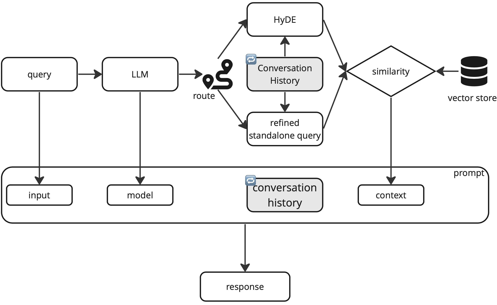
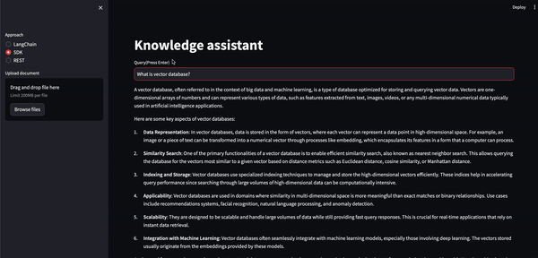
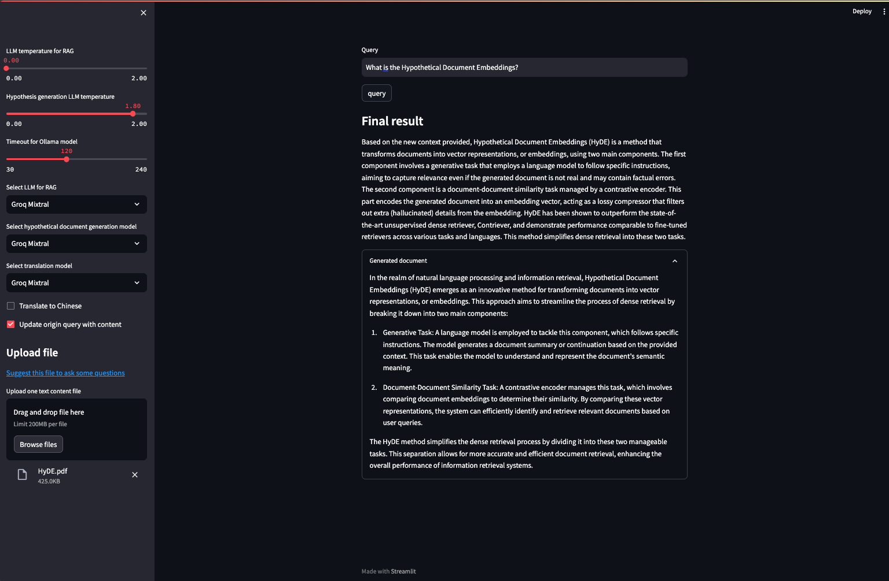
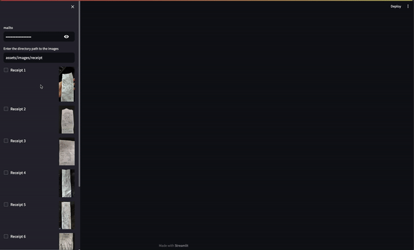

Awesome LLMs applications and experiments
=============

Chat Your Doc is an experimental project aimed at exploring various applications based on LLM. Although it is nominally a chatbot project, its purpose is broader. The project explores various applications using tools such as [LangChain](https://www.langchain.com/), [LlamaIndex](https://www.llamaindex.ai/). In the "Lab Apps" section, you can find many examples, including simple and complex ones. The project focuses on researching and exploring various LLM applications, while also incorporating other fields such as UX and computer vision. The "Lab App" section includes a table with links to various apps, descriptions, launch commands, and demos.

----

#### RAG 


----

- [Setup](#setup)
    - [Some keys](#some-keys)
    - [Conda](#conda)
    - [Pip](#pip)  
- [Storage](#storage) 
- [Popular solutions](#popular-solutions)
  - [How to chat with a document via vector database?](#how-to-chat-with-a-document-via-vector-database)
  - [Simple](#simple)
  - [Intermediate](#intermediate)
  - [Advanced](#advanced)
- [Notebooks](#notebooks)
- [Star History](#star-history)

----

#### Knowledge Center

Also, take a look at a use-case known as [Knowledge Center](https://github.com/XinyueZ/knowledge-center) that leverages different RAG or Chunking techniques in this repository.

#### Typical multimodal Chatbot sample

- Video: https://drive.google.com/file/d/1AMAi561gbAuHyT5BQFt7wlg5Xockx-Ni/view?usp=drive_link
- Source: https://github.com/XinyueZ/chat-your-doc/blob/master/simple/multimodal_chat.py
- Start: `streamlit run simple/multimodal_chat.py --server.port 8000 --server.enableCORS false`

----

# Setup

## Some keys

For OpenAI, set API-KEY to your environment variables.

[Get OpenAI API-KEY](https://platform.openai.com/account/api-keys)

```bash
export OPENAI_API_KEY="sk-$TJHGFHJDSFDGAFDFRTHT§$%$%&§%&"
```

## Conda

```bash
conda env create -n chat-ur-doc -f environment.yml
conda activate chat-ur-doc
```

## Pip

```bash
pip install -r requirements.txt
``` 
----

# Storage


ref: https://python.langchain.com/docs/modules/data_connection/vectorstores/

Chroma, FAISS

`pip install chromadb`

`pip install faiss-cpu`


# Popular solutions 

## Boilerplate codes of tokenization in LLM project, take away codes.

[LLM fine-tuning step: Tokenizing](https://medium.com/@teetracker/llm-fine-tuning-step-tokenizing-caebb280cfc2)

## How to chat with a document via vector database?

[Chat with your PDF （Streamlit Demo)](https://teetracker.medium.com/chat-with-your-pdf-streamlit-demo-eb2a3a2882a3)

## How do auto-annotation (object detection) on images?

[LLM, LangChain Agent, Computer Vision](https://medium.com/@teetracker/experimentation-llm-langchain-agent-computer-vision-0c405deb7c6e) 

## OpenAI Assistants, awesome, it manages a lot of things for you.

[How to Use OpenAI Assistants (API)](https://teetracker.medium.com/how-to-use-openai-assistants-api-2281d67486a0)

## Advanced RAG approaches, learn details how RAG works.
[Advanced RAG](https://medium.com/@teetracker/advanced-rag-228510e7ac77)

## LangChain App Template Example

[Experience with the LangChain App Template](https://teetracker.medium.com/experience-with-the-langchain-app-template-349fb47161c1)

> [wine price app, prompt and query wine price](simple/wine-price-app). The application has been created, just need to create data, install Poetry and run it. 

> Full instructions for creating a LangChain App Template can be found here: [LangChain App Template](https://python.langchain.com/docs/guides/deployments/template_repos)

# RAG, Vector and Summary pattern implementation

[Llama-Index: RAG with Vector and Summary](https://medium.com/@teetracker/llama-index-multi-vector-retriever-summary-9231137d3cab)
> Multi-Retrievers with Vector and Summary pattern implementation.

[Llama-Index: RAG with Vector and Summary by using Agent](https://medium.com/@teetracker/llama-index-rag-with-vector-and-summary-using-agent-551b4b7cef16)
> Agent for Vector and Summary pattern implementation.

[Create Agent from Scratch](https://teetracker.medium.com/building-an-agent-from-scratch-with-langchain-2e1d1ef2f57f) 

> Intuitively create an agent from scratch with LangChain.

[Create Agent from Scratch](https://medium.com/@teetracker/llama-index-building-an-agent-from-scratch-73be48f7f266) 

> Intuitively create an agent from scratch with  [LlamaIndex](https://www.llamaindex.ai/).

[Multi-Query Retrieval with RAG](https://teetracker.medium.com/langchain-llama-index-rag-with-multi-query-retrieval-4e7df1a62f83)

> Enhance query context with intermediate queries during RAG to improve information retrieval for the original query.

[Prio-reasoning](https://teetracker.medium.com/prio-reasoning-919fd6e90d86)

> Explain how prio-reasoning works in LangChain(qa-chain with refine) and LlamaIndex (MultiStepQueryEngine).

[RAG with Multi-Query pattern](https://medium.com/@teetracker/rag-with-multi-query-pattern-7272deb3401a) 

> Introduce the Multi-Query pattern in bundle and step-down solutions.

[LangGraph: hello,world!](https://teetracker.medium.com/langgraph-hello-world-d913677cc222)   

> Introduce the hello,world version use-case with LangGraph, just simple example to kick off the topic.

[Quick Tour: Ollama+Gemma+LangChain](https://teetracker.medium.com/quick-tour-ollama-gemma-langchain-ea28e5314256) 

> Use ollama to deploy and use Gemma with langchain on local machine.

[RAG with Hypothetical Document Embeddings(HyDE)](https://teetracker.medium.com/rag-with-hypothetical-document-embeddings-hyde-0edeca23f891) 

> Hypothetical Document Embeddings, two-steps process of RAG. Implementation of [HyDE](https://arxiv.org/pdf/2212.10496.pdf) retrieval by  [LlamaIndex](https://www.llamaindex.ai/), hybrid, local or remote LLMs.

[LangChain: Use LLM Agent for World GPU Demand Prediction Report](https://medium.com/@teetracker/langchain-use-llm-agent-for-world-gpu-supply-and-demand-analysis-report-52f93f7bc8e8)

> Reflecting the analytical methods of the AI era, based on the Agent mechanism and generative AI, intelligently generates necessary information and code.

[LangChain: Multi-User Conversation Support](https://medium.com/@teetracker/langchain-multi-user-conversation-1ea1c8671e33) 

> By using some methods, make the conversation able to happen among multiple users, achieving the basic of a simple “group conversation”. 

[LangChain: History-Driven RAG Enhanced By LLM-Chain Routing LangChain](https://teetracker.medium.com/langchain-history-driven-rag-enhanced-by-llm-chain-routing-9a9d689098ae)

> Using LLM to predict the routing of the chain and achieve Retrieval Augmented Generation with help of conversation history applying HyDE or refined standalone query. 

[LangChain: Multi-User Conversation Support(Follow-up)](https://teetracker.medium.com/langchain-multi-user-conversation-follow-up-9cc277eb445f)

> A follow-up read: Use Cohere’s documents and a special field in additional_kwargsfeature to enhance the organization of information in multi-user conversation.

[(Llama-Index Workflow)Translation Agent via Reflection Workflow](https://teetracker.medium.com/llamaindex-workflow-translation-agent-via-reflection-workflow-7ed51eeb5257)

> Implemention of [Translation Agent: Agentic translation using reflection workflow](https://github.com/andrewyng/translation-agent/tree/main) with Llama-Index [workflow framework](https://www.llamaindex.ai/blog/introducing-workflows-beta-a-new-way-to-create-complex-ai-applications-with-llamaindex).

## Simple

| App | Description | Launch | Demo |
| --- |--- | --- | --- |
| [i-ask.sh](simple/i-ask.sh)  | Simply ask & answer via OpenAI API | `i-ask.sh "Who is Joe Biden?"` |  | 
| [chat_openai.py](simple/chat_openai.py)  | Just one chat session  | `streamlit run simple/chat_openai.py --server.port 8000 --server.enableCORS false` |  | 
| [open_api_llm_app.py](simple/open_api_llm_app.py)   | Use OpenAI LLM to answer simple question | `streamlit run simple/open_api_llm_app.py --server.port 8001 --server.enableCORS false` |  | 
| [read_html_app.py](simple/read_html_app.py)  | Get html content and chunk | `streamlit run simple/read_html_app.py --server.port 8002 --server.enableCORS false` |  | 
| [chatbot.py](simple/chatbot.py)   | Basic chatbot | `streamlit run simple/chatbot.py --server.port 8003 --server.enableCORS false` |  | 
| [retriever.py](simple/retriever.py)  | Use concept of retriever and LangChain Expression Language (LCEL) | `streamlit run simple/retriever.py --server.port 8004 --server.enableCORS false` |  | 
| [hello_llamaindex.py](simple/hello_llamaindex.py) | A very simple [LlamaIndex](https://www.llamaindex.ai/) to break ice of the story. | `streamlit run simple/hello_llamaindex.py --server.port 8005 --server.enableCORS false` | | 
| [llamaindex_context.py](simple/llamaindex_context.py)  | A simple app of [LlamaIndex](https://www.llamaindex.ai/), introduce of context for configuration, StorageContext, ServiceContext. | `streamlit run simple/llamaindex_context.py --server.port 8006 --server.enableCORS false` | | 
| [llamaindex_hub_simple.py](simple/llamaindex_hub_simple.py)   | A simple app of [LlamaIndex](https://www.llamaindex.ai/), introduce of load stuff from [https://llamahub.ai/](LlamaHub). | `streamlit run simple/llamaindex_hub_simple.py --server.port 8007 --server.enableCORS false` | | 
| [prio_reasoning_context.py](simple/prio_reasoning_context.py)   | A simple app that based on RAG with Prio-Reasoning pattern in  [LlamaIndex](https://www.llamaindex.ai/) or LangChain.| `streamlit run simple/prio_reasoning_context.py --server.port 8008 --server.enableCORS false` | [read](https://teetracker.medium.com/https://teetracker.medium.com/prio-reasoning-919fd6e90d86)    | 
| [ollama_gemma.py](simple/ollama_gemma.py)   | A [Ollama](https://ollama.com/library/gemma) for Gemma integration with the langchain.|  | [read](https://teetracker.medium.com/quick-tour-ollama-gemma-langchain-ea28e5314256)   | 
| [nvidia_vs_groq.py](simple/nvidia_vs_groq.py)   | Compare [Nvidia](Nvidiahttps://python.langchain.com/docs/integrations/text_embedding/nvidia_ai_endpoints) API and [Groq](https://python.langchain.com/docs/integrations/chat/groq), by using `llama2` and `mixtral_8x7b`| `streamlit run simple/nvidia_vs_groq.py --server.port 8009 --server.enableCORS false`   | [read](https://teetracker.medium.com/langchain-history-driven-rag-enhanced-by-llm-chain-routing-9a9d689098ae)    | 
| [llamaindex_workflow_reflection_flow.py](simple/llamaindex_workflow_reflection_flow.py)   | Implemention of [Translation Agent: Agentic translation using reflection workflow](https://github.com/andrewyng/translation-agent/tree/main) with Llama-Index [workflow framework](https://www.llamaindex.ai/blog/introducing-workflows-beta-a-new-way-to-create-complex-ai-applications-with-llamaindex) | `streamlit run simple/llamaindex_workflow_reflection_flow.py --server.port 8009 --server.enableCORS false`   | [read](https://teetracker.medium.com/llamaindex-workflow-translation-agent-via-reflection-workflow-7ed51eeb5257)   | 

## Intermediate

| App | Description | Launch | Demo |
| --- | --- | --- | --- |
| [sim_app.py](intermediate/sim_app.py)  | Use the vector database to save file in chunks and retrieve similar content from the database | `streamlit run intermediate/sim_app.py --server.port 8002 --server.enableCORS false` |  | 
| [llm_chain_translator_app.py](intermediate/llm_chain_translator_app.py) | Use LLMChain to do language translation | `streamlit run intermediate/llm_chain_translator_app.py --server.port 8003 --server.enableCORS false` |    | 
| [html_summary_chat_app.py](intermediate/html_summary_chat_app.py)   | Summary html content | `streamlit run intermediate/html_summary_chat_app.py --server.port 8004 --server.enableCORS false` |  | 
| [html_2_json_app.py](intermediate/html_2_json_app.py) | Summary html keypoints into keypoint json | `streamlit run intermediate/html_2_json_app.py --server.port 8005 --server.enableCORS false` |  | 
| [assistants.py](intermediate/assistants.py)   | Use [OpenAI Assistants API](https://platform.openai.com/docs/assistants) in different ways | `streamlit run intermediate/assistants.py --server.port 8006 --server.enableCORS false` | [read](https://teetracker.medium.com/how-to-use-openai-assistants-api-2281d67486a0)      | 
| [hyde_retrieval.py](intermediate/hyde_retrieval.py)   | Implementation of [HyDE](https://arxiv.org/pdf/2212.10496.pdf) retrieval by  [LlamaIndex](https://www.llamaindex.ai/), hybrid, local or remote LLMs. | `streamlit run intermediate/hyde_retrieval.py --server.port 8007 --server.enableCORS false` | [read](https://teetracker.medium.com/rag-with-hypothetical-document-embeddings-hyde-0edeca23f891)        | 

## 💥 Advanced

| App | Description | Launch | Demo |
| --- | --- | --- | --- |
|  [qa_chain_pdf_app.py](advanced/qa_chain_pdf_app.py)  | Ask info from PDF file, chat with it | `streamlit run advanced/qa_chain_pdf_app.py --server.port 8004 --server.enableCORS false` |    | 
|  [faiss_app.py](advanced/faiss_app.py)  | Ask info from a internet file, find similar docs and answer with  **VectorDBQAWithSourcesChain** | `streamlit run advanced/faiss_app.py --server.port 8005 --server.enableCORS false` |    | 
|  [html_2_json_output_app.py](advanced/html_2_json_output_app.py)  | Load html content and summary into json objects | `streamlit run advanced/html_2_json_output_app.py --server.port 8006 --server.enableCORS false` |    | 
|  [joke_bot.py](advanced/joke_bot.py)  | Prompt engineering to get one random joke or rate one joke | `python advanced/joke_bot.py --rate "Why couldn't the bicycle stand up by itself? It was two tired."` or `python advanced/joke_bot.py --tell --num 4` |   | 
|  [chat_ur_docs.py](advanced/chat_ur_docs.py)   | Chat with documents freely | `streamlit run advanced/chat_ur_docs.py --server.port 8004 --server.enableCORS false` |[read](https://medium.com/@teetracker/chat-with-your-pdf-streamlit-demo-eb2a3a2882a3)   | 
|  [image_auto_annotation.py](advanced/image_auto_annotation.py)   | Use LLM, LangChain Agent and GroundingDINO to detect objects on images freely (auto-annotation) | `streamlit run advanced/image_auto_annotation.py --server.port 8006 --server.enableCORS false` | [read](https://medium.com/@teetracker/experimentation-llm-langchain-agent-computer-vision-0c405deb7c6e)   | 
|  [langgraph_auto_annotation.py](advanced/langgraph_auto_annotation.py)   | LangGraph, YOLOv8 World, Gemma, BlipProcessor or OpenAI-Vision to detect on image freely (auto-annotation) | `streamlit run advanced/langgraph_auto_annotation.py --server.port 8006 --server.enableCORS false` |     | 
|  [adv_rag.py](advanced/adv_rag.py)  | Advanced RAG approaches, use partition_pdf to extract texts and tables and analyze them | `streamlit run advanced/adv_rag.py --server.port 8007 --server.enableCORS false` | [read](https://medium.com/@teetracker/advanced-rag-228510e7ac77) | 
|  [llamaindex_vector_summary_retriever.py](advanced/llamaindex_vector_summary_retriever.py)    | Use [LlamaIndex](https://www.llamaindex.ai/) to apply vectory/summary pattern by using multi retrievers | `streamlit run advanced/llamaindex_multi_vector_summary.py --server.port 8008 --server.enableCORS false` |  [read](https://medium.com/@teetracker/llama-index-multi-vector-retriever-summary-9231137d3cab)    | 
|  [llamaindex_vector_summary_agent.py](advanced/llamaindex_vector_summary_agent.py)  | Use [LlamaIndex](https://www.llamaindex.ai/) to apply vectory/summary pattern by using agent | `streamlit run advanced/llamaindex_multi_vector_summary_agent.py --server.port 8009 --server.enableCORS false` | [read](https://medium.com/@teetracker/llama-index-rag-with-vector-and-summary-using-agent-551b4b7cef16)     | 
|  [multi_queries.py](advanced/multi_queries.py)  | Use [LlamaIndex](https://www.llamaindex.ai/) and LangChain to apply the multi-queries pattern, including build method of the LangChain, and custom retriever based solution in Llama-Index, also the other sub-query based solutions | `streamlit run advanced/multi_queries.py --server.port 8010 --server.enableCORS false` | [read](https://medium.com/@teetracker/rag-with-multi-query-pattern-7272deb3401a)         | 
|  [langgraph_agent_mailtool.py](advanced/langgraph_agent_mailtool.py)  | Use LangGraph (Groq is used for agent) to driven a Email deliever of the custom receipts. | `streamlit run advanced/langgraph_agent_mailtool.py --server.port 8011 --server.enableCORS false` |       | 
|  [llamaindex_adaptive_rag.py](advanced/llamaindex_adaptive_rag.py)  | App that implements the [adaptive RAG pattern](https://arxiv.org/abs/2403.14403) | `streamlit run advanced/llamaindex_adaptive_rag.py --server.port 8012 --server.enableCORS false` |      | 

# Notebooks

| Notebook |Description |  Demo |
| --- | --- | --- |
| [audio2text2LLM.ipynb](notebooks/audio2text2LLM.ipynb)  | Basic audio to text and summary | | 
| [audio2text2music.ipynb](notebooks/audio2text2music.ipynb)   | [audiocraft](https://github.com/facebookresearch/audiocraft), Whisper,  automatic-speech-recognition, speech to text, generate music by the text, synthesis speech+BGM |  | 
| [image_description.ipynb](notebooks/image_description.ipynb)   |  Use OpenAI Vision or [blip-image-captioning-base](https://huggingface.co/Salesforce/blip-image-captioning-base), [blip-image-captioning-large](https://huggingface.co/Salesforce/blip-image-captioning-large), a use-case to get the image description. | | 
| [image_desc2music.ipynb](notebooks/image_desc2music.ipynb)   | [audiocraft](https://github.com/facebookresearch/audiocraft) [blip-image-captioning-base](https://huggingface.co/Salesforce/blip-image-captioning-base), [blip-image-captioning-large](https://huggingface.co/Salesforce/blip-image-captioning-large), a use-case to get the image description and generate music based on the image | | 
| [langchain_agent_scratch.ipynb](notebooks/langchain_agent_scratch.ipynb)  | Create the agent from scratch in langchain  | [read](https://teetracker.medium.com/building-an-agent-from-scratch-with-langchain-2e1d1ef2f57f)    | 
| [llamaindex_agent_from_scratch.ipynb](notebooks/llamaindex_agent_from_scratch.ipynb)  | Create the agent from scratch with [LlamaIndex](https://www.llamaindex.ai/)  | [read](https://teetracker.medium.com/llama-index-building-an-agent-from-scratch-73be48f7f266)    | 
| [llamaindex_vector_summary_retriever.ipynb](notebooks/llamaindex_vector_summary_retriever.ipynb)  | Use [LlamaIndex](https://www.llamaindex.ai/) to apply vectory/summary pattern by using multi retrievers | [read](https://medium.com/@teetracker/llama-index-multi-vector-retriever-summary-9231137d3cab)    | 
| [llamaindex_vector_summary_agent.ipynb](notebooks/llamaindex_vector_summary_agent.ipynb)  | Use [LlamaIndex](https://www.llamaindex.ai/) to apply vectory/summary pattern by using agent | [read](https://medium.com/@teetracker/llama-index-rag-with-vector-and-summary-using-agent-551b4b7cef16)     | 
| [multi_queries_retrieval.ipynb](notebooks/multi_queries_retrieval.ipynb)  | Use [LlamaIndex](https://www.llamaindex.ai/) and LangChain to apply mutli-query pattern for RAG | [read](https://teetracker.medium.com/langchain-llama-index-rag-with-multi-query-retrieval-4e7df1a62f83)     | 
| [yolo8_world_and_openai_vision.py](notebooks/yolo8_world_and_openai_vision.py)  | Use [YoLoV8 World](https://docs.ultralytics.com/zh/models/yolo-world/#predict-usage) and OpenAI Vision together to enchance image auto-annotation |    | 
| [yolo8_world_and_gemma.py](notebooks/yolo8_world_and_gemma.py)  | Use [YoLoV8 World](https://docs.ultralytics.com/zh/models/yolo-world/#predict-usage), OpenAI Vision, Ollama Gemma integration to enchance image auto-annotation |     | 
| [langgraph_helloworld.ipynb](notebooks/langgraph_helloworld.ipynb)  | hello,world version of langgraph |   [read](https://teetracker.medium.com/langgraph-hello-world-d913677cc222)      | 
| [langchain_agent_gmail.ipynb](notebooks/langchain_agent_gmail.ipynb)  |  Use LangGraph to driven a Email deliever of the custom receipts. |        | 
| [hyde_retrieval.ipynb](notebooks/hyde_retrieval.ipynb)  | Implementation of [HyDE](https://arxiv.org/pdf/2212.10496.pdf) retrieval by  [LlamaIndex](https://www.llamaindex.ai/), hybrid, local or remote LLMs. | [read](https://teetracker.medium.com/rag-with-hypothetical-document-embeddings-hyde-0edeca23f891)           | 
| [agent_gpu_demand_prediction.ipynb](notebooks/agent_gpu_demand_prediction.ipynb)  | Use pure Agent (LangChain) to generate a report paper of global GPU demand prediction. | [read](https://medium.com/@teetracker/langchain-use-llm-agent-for-world-gpu-supply-and-demand-analysis-report-52f93f7bc8e8),, | 
| [multi_user_conversation.ipynb](notebooks/multi_user_conversation.ipynb)  | Try to do multi-user chat with LangChain, `ConversationBufferMemory`, `ConversationChain`, `RunnableWithMessageHistory`, `ChatMessageHistory`, `convert_openai_messages` and LCEL | [read](https://medium.com/@teetracker/langchain-multi-user-conversation-1ea1c8671e33) [read (Follow-up)](https://teetracker.medium.com/langchain-multi-user-conversation-follow-up-9cc277eb445f)| 
| [DenseXRetrieval.ipynb](notebooks/DenseXRetrieval.ipynb)  | [Dense X Retrieval: What Retrieval Granularity Should We Use?](https://arxiv.org/abs/2312.06648) by using [Llama Packs](https://docs.llamaindex.ai/en/latest/community/llama_packs/) | | 


# Star History

<br>
<div align="left">


</div>
<br>
