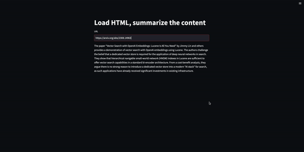

Awesome LLMs applications and experiments
=============

Chat Your Doc is an experimental project aimed at exploring various applications based on LLM. Although it is nominally a chatbot project, its purpose is broader. The project explores various applications using tools such as [LangChain](https://www.langchain.com/), [LlamaIndex](https://www.llamaindex.ai/). In the "Lab Apps" section, you can find many examples, including simple and complex ones. The project focuses on researching and exploring various LLM applications, while also incorporating other fields such as UX and computer vision. The "Lab App" section includes a table with links to various apps, descriptions, launch commands, and demos.

----

- [Setup](#setup)
    - [Some keys](#some-keys)
    - [Conda](#conda)
    - [Pip](#pip)  
- [Storage](#storage) 
- [Popular solutions](#popular-solutions)
  - [How to chat with a document via vector database?](#how-to-chat-with-a-document-via-vector-database)
  - [Simple](#simple)
  - [Intermediate](#intermediate)
  - [Advanced](#advanced)
- [Notebooks](#notebooks)
- [Notes](#notes)

----
# Setup

## Some keys

For OpenAI, set API-KEY to your environment variables.

[Get OpenAI API-KEY](https://platform.openai.com/account/api-keys)

```bash
export OPENAI_API_KEY="sk-$TJHGFHJDSFDGAFDFRTHT§$%$%&§%&"
```

## Conda

```bash
conda env create -n chat-ur-doc -f environment.yml
conda activate chat-ur-doc
```

## Pip

```bash
pip install -r requirements.txt
``` 
----

# Storage


ref: https://python.langchain.com/docs/modules/data_connection/vectorstores/

Chroma, FAISS

`pip install chromadb`

`pip install faiss-cpu`


# Popular solutions 

## Boilerplate codes of tokenization in LLM project, take away codes.

[LLM fine-tuning step: Tokenizing](https://medium.com/@teetracker/llm-fine-tuning-step-tokenizing-caebb280cfc2)

## How to chat with a document via vector database?

[Chat with your PDF （Streamlit Demo)](https://teetracker.medium.com/chat-with-your-pdf-streamlit-demo-eb2a3a2882a3)

## How do auto-annotation (object detection) on images?

[LLM, LangChain Agent, Computer Vision](https://medium.com/@teetracker/experimentation-llm-langchain-agent-computer-vision-0c405deb7c6e) 

## OpenAI Assistants, awesome, it manages a lot of things for you.

[How to Use OpenAI Assistants (API)](https://teetracker.medium.com/how-to-use-openai-assistants-api-2281d67486a0)

## Advanced RAG approaches, learn details how RAG works.
[Advanced RAG](https://medium.com/@teetracker/advanced-rag-228510e7ac77)

## LangChain App Template Example

[Experience with the LangChain App Template](https://teetracker.medium.com/experience-with-the-langchain-app-template-349fb47161c1)

> [wine price app, prompt and query wine price](simple/wine-price-app). The application has been created, just need to create data, install Poetry and run it. 

> Full instructions for creating a LangChain App Template can be found here: [LangChain App Template](https://python.langchain.com/docs/guides/deployments/template_repos)

## Llama-Index: Multi-Vector Retriever / Summary

[Multi-Vector Retriever / Summary with Llama-Index](https://teetracker.medium.com/llama-index-multi-vector-retriever-summary-9231137d3cab)

>  Advanced RAG approache with Llama-Index to implement multi-vector retriever and summary.

[Create Agent from Scratch](https://teetracker.medium.com/building-an-agent-from-scratch-with-langchain-2e1d1ef2f57f) 

> Intuitively create an agent from scratch with LangChain.

## Simple

| App | Models & Components|Description | Launch | Demo |
| --- | --- |--- | --- | --- |
| [i-ask.sh](simple/i-ask.sh)  |OpenAI http-request| Simply ask & answer via OpenAI API | `i-ask.sh "Who is Joe Biden?"` |  | 
| [chat_openai.py](simple/chat_openai.py)  |ChatOpenAI, LangChain | Just one chat session  | `streamlit run simple/chat_openai.py --server.port 8000 --server.enableCORS false` |  | 
| [open_api_llm_app.py](simple/open_api_llm_app.py)  |OpenAI, LLMChain, LangChain| Use OpenAI LLM to answer simple question | `streamlit run simple/open_api_llm_app.py --server.port 8001 --server.enableCORS false` |  | 
| [read_html_app.py](simple/read_html_app.py)  | CharacterTextSplitter, LangChain | Get html content and chunk| `streamlit run simple/read_html_app.py --server.port 8002 --server.enableCORS false` |  | 
| 💥 [chatbot.py](simple/chatbot.py)  | ConversationChain, ConversationBufferMemory, ChatOpenAI, LangChain | Basic chatbot | `streamlit run simple/chatbot.py --server.port 8003 --server.enableCORS false` |  | 
| [retriever.py](simple/retriever.py)  | DocArrayInMemorySearch, RunnableMap, StrOutputParser, ChatOpenAI, LangChain | Use concept of retriever and LangChain Expression Language (LCEL) | `streamlit run simple/retriever.py --server.port 8004 --server.enableCORS false` |  | 
| [hello_llamaindex.py](simple/hello_llamaindex.py)  | A very simple [LlamaIndex](https://www.llamaindex.ai/) to break ice of the story. | `streamlit run simple/hello_llamaindex.py --server.port 8005 --server.enableCORS false` | | 
| [llamaindex_context.py](simple/llamaindex_context.py)  | A simple app of [LlamaIndex](https://www.llamaindex.ai/), introduce of context for configuration, StorageContext, ServiceContext. | `streamlit run simple/llamaindex_context.py --server.port 8006 --server.enableCORS false` | | 
| [llamaindex_hub_simple.py](simple/llamaindex_hub_simple.py)  | A simple app of [LlamaIndex](https://www.llamaindex.ai/), introduce of load stuff from [https://llamahub.ai/](LlamaHub) | `streamlit run simple/llamaindex_hub_simple.py --server.port 8007 --server.enableCORS false` | | 

## Intermediate

| App | Models & Components|Description | Launch | Demo |
| --- | --- |--- | --- | --- |
| 💥 [sim_app.py](intermediate/sim_app.py)  | Chroma,  RecursiveCharacterTextSplitter, OpenAIEmbeddings, LangChain | Use the vector database to save file in chunks and retrieve similar content from the database | `streamlit run intermediate/sim_app.py --server.port 8002 --server.enableCORS false` |  | 
| [llm_chain_translator_app.py](intermediate/llm_chain_translator_app.py)  | ChatOpenAI, LLMChain, LangChain | Use LLMChain to do language translation | `streamlit run intermediate/llm_chain_translator_app.py --server.port 8003 --server.enableCORS false` |    | 
| [html_summary_chat_app.py](intermediate/html_summary_chat_app.py)  | ChatOpenAI, LangChain | Summary html content | `streamlit run intermediate/html_summary_chat_app.py --server.port 8004 --server.enableCORS false` |  | 
| 💥 [html_2_json_app.py](intermediate/html_2_json_app.py)  | ChatOpenAI, LangChain | Summary html keypoints into keypoint json | `streamlit run intermediate/html_2_json_app.py --server.port 8005 --server.enableCORS false` |  | 
| [assistants.py](intermediate/assistants.py)  | OpenAIAssistantRunnable, LangChain, OpenAI SDK | Use [OpenAI Assistants API](https://platform.openai.com/docs/assistants) in different ways | `streamlit run intermediate/assistants.py --server.port 8006 --server.enableCORS false` | [read](https://teetracker.medium.com/how-to-use-openai-assistants-api-2281d67486a0)      | 

## 💥 Advanced

| App |  Models & Components|Description | Launch | Demo |
| --- | --- |--- | --- | --- |
|  [qa_chain_pdf_app.py](advanced/qa_chain_pdf_app.py)  |OpenAI, Chroma, RecursiveCharacterTextSplitter, load_qa_chain->BaseCombineDocumentsChain, LangChain| Ask info from PDF file, chat with it | `streamlit run advanced/qa_chain_pdf_app.py --server.port 8004 --server.enableCORS false` |    | 
|  [faiss_app.py](advanced/faiss_app.py)  |OpenAI, FAISS, OpenAIEmbeddings, RecursiveCharacterTextSplitter,  **VectorDBQAWithSourcesChain** LangChain | Ask info from a internet file, find similar docs and answer with  **VectorDBQAWithSourcesChain** | `streamlit run advanced/faiss_app.py --server.port 8005 --server.enableCORS false` |    | 
|  [html_2_json_output_app.py](advanced/html_2_json_output_app.py)  | ResponseSchema, StructuredOutputParser, LangChain | Load html content and summary into json objects | `streamlit run advanced/html_2_json_output_app.py --server.port 8006 --server.enableCORS false` |    | 
|  [joke_bot.py](advanced/joke_bot.py)  | ChatPromptTemplate, HumanMessagePromptTemplate, SystemMessagePromptTemplate ResponseSchema, StructuredOutputParser, ChatOpenAI, LangChain | Prompt engineering to get one random joke or rate one joke | `python advanced/joke_bot.py --rate "Why couldn't the bicycle stand up by itself? It was two tired."` or `python advanced/joke_bot.py --tell --num 4` |   | 
|  [chat_ur_docs.py](advanced/chat_ur_docs.py)  | ConversationalRetrievalChain, ConversationBufferMemory, ChatOpenAI, LangChain | Chat with documents freely | `streamlit run advanced/chat_ur_docs.py --server.port 8004 --server.enableCORS false` |[read](https://medium.com/@teetracker/chat-with-your-pdf-streamlit-demo-eb2a3a2882a3)   | 
|  [image_auto_annotation.py](advanced/image_auto_annotation.py)  |ChatOpenAI, AgentExecutor, BaseTool,  BlipForConditionalGeneration, BlipProcessor, GroundingDINO | Use LLM, LangChain Agent and GroundingDINO to detect objects on images freely (auto-annotation) | `streamlit run advanced/image_auto_annotation.py --server.port 8006 --server.enableCORS false` | [read](https://medium.com/@teetracker/experimentation-llm-langchain-agent-computer-vision-0c405deb7c6e)   | 
|  [adv_rag.py](advanced/adv_rag.py)  |ChatOpenAI, partition_pdf| Advanced RAG approaches, use partition_pdf to extract texts and tables and analyze them | `streamlit run advanced/adv_rag.py --server.port 8007 --server.enableCORS false` | [read](https://medium.com/@teetracker/advanced-rag-228510e7ac77) | 
|  [llamaindex_vector_summary_retriever.py](advanced/llamaindex_vector_summary_retriever.py)  | Use [LlamaIndex](https://www.llamaindex.ai/) to apply vectory/summary pattern by using multi retrievers | `streamlit run advanced/llamaindex_multi_vector_summary.py --server.port 8008 --server.enableCORS false` |  [read](https://teetracker.medium.com/llama-index-multi-vector-retriever-summary-9231137d3cab)    | 
|  [llamaindex_vector_summary_agent.py](advanced/llamaindex_vector_summary_agent.py)  | Use [LlamaIndex](https://www.llamaindex.ai/) to apply vectory/summary pattern by using agent | `streamlit run advanced/llamaindex_multi_vector_summary_agent.py --server.port 8009 --server.enableCORS false` |     | 

# Notebooks

| Notebook | Models & Components|Description |  Demo |
| --- | --- |--- | --- |
| [audio2text2LLM.ipynb](notebooks/audio2text2LLM.ipynb)  | ChatOpenAI, LangChain, Whisper,  automatic-speech-recognition | Basic audio to text and summary | | 
| [audio2text2music.ipynb](notebooks/audio2text2music.ipynb)  | [audiocraft](https://github.com/facebookresearch/audiocraft), Whisper,  automatic-speech-recognition | Speech to text, generate music by the text, synthesis speech+BGM |  | 
| [image_description.ipynb](notebooks/image_description.ipynb)  | [blip-image-captioning-base](https://huggingface.co/Salesforce/blip-image-captioning-base), [blip-image-captioning-large](https://huggingface.co/Salesforce/blip-image-captioning-large) | A use-case to get the image description | | 
| [image_desc2music.ipynb](notebooks/image_desc2music.ipynb)  | [audiocraft](https://github.com/facebookresearch/audiocraft) [blip-image-captioning-base](https://huggingface.co/Salesforce/blip-image-captioning-base), [blip-image-captioning-large](https://huggingface.co/Salesforce/blip-image-captioning-large) | A use-case to get the image description and generate music based on the image | | 
| [langchain_agent_scratch.ipynb](notebooks/langchain_agent_scratch.ipynb)  | Create the agent from scratch | [read](https://teetracker.medium.com/building-an-agent-from-scratch-with-langchain-2e1d1ef2f57f)  |   | 
| [llamaindex_vector_summary_retriever.ipynb](notebooks/llamaindex_vector_summary_retriever.ipynb)  | Use [LlamaIndex](https://www.llamaindex.ai/) to apply vectory/summary pattern by using multi retrievers | [read](https://medium.com/@teetracker/llama-index-multi-vector-retriever-summary-9231137d3cab)  |   | 
| [llamaindex_vector_summary_agent.ipynb](notebooks/llamaindex_vector_summary_agent.ipynb)  | Use [LlamaIndex](https://www.llamaindex.ai/) to apply vectory/summary pattern by using agent | [read]()  |   | 


# Notes 

<details>
<summary><span style="font-weight: bold;">These key notes can be very helpful in getting up to speed quickly. Look for them while you're learning and share them with others. These notes are especially useful when you're asking yourself questions like why, what, and how.
</span></summary>
<style>
  table {
    width: 100%;
    border-collapse: collapse;
  }
  td {
    padding: 8px;
    text-align: center;
  }
  img {
    width: 100%;
    height: auto;
  }
  @media screen and (max-width: 600px) {
    table, td, tr {
      display: block;
    }
    td {
      text-align: center;
      border-bottom: none;
    }
  }
</style>

<table>
  <tr>
    <td></td>
    <td></td>
    <td></td>
  </tr>
  <tr>
    <td></td>
    <td></td>
    <td></td>
  </tr>
  <tr>
    <td></td>
    <td></td>
    <td></td>
    <td></td>
  </tr>
  <tr>
    <td></td>
    <td></td>
    <td></td>
    <td></td>
  </tr>
  <tr>
    <td></td>
    <td></td> 
  </tr>
</table>
</details>